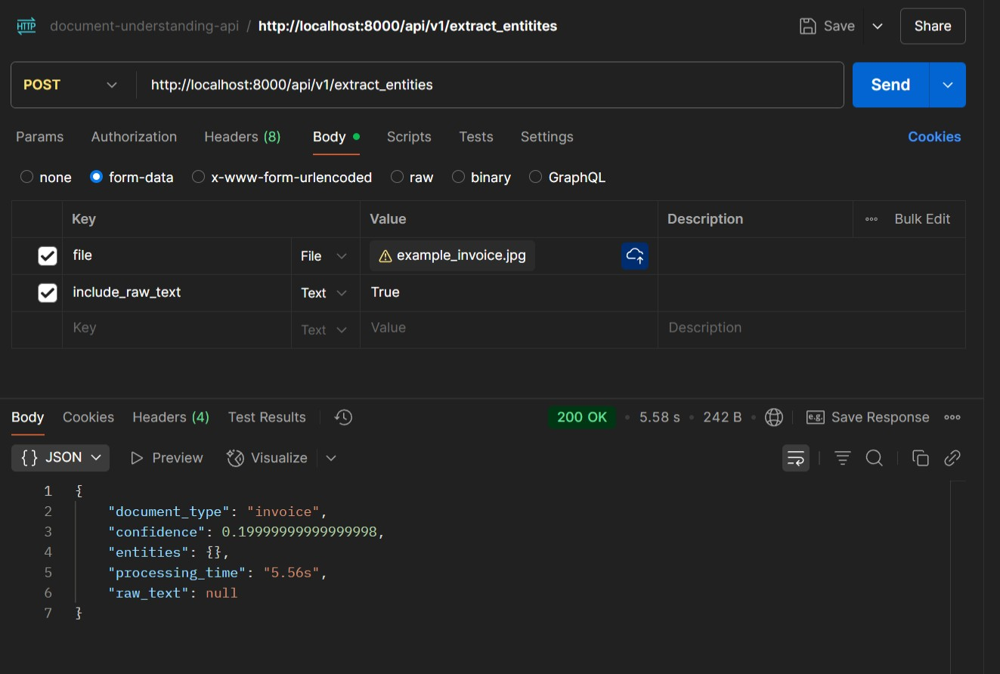
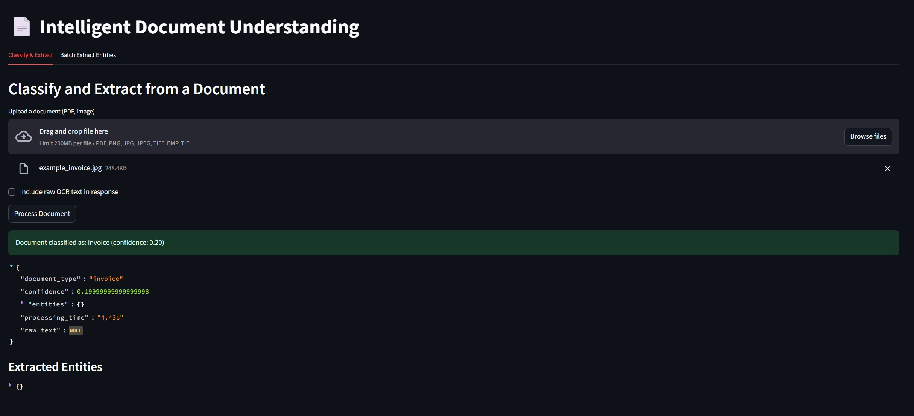
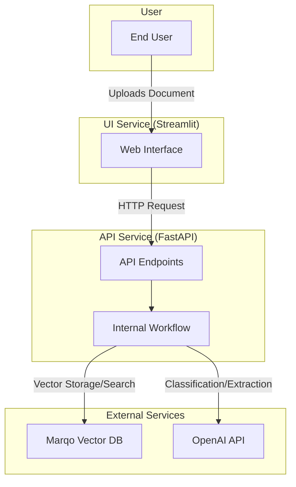

# Intelligent Document Understanding API

This project provides a powerful API for classifying and extracting information from various types of documents. It uses a combination of OCR, a vector database for similarity searches, and large language models (LLMs) for classification and entity extraction.

## 🌟 Features

*   **Document Classification**: Automatically identifies the type of a document (e.g., invoice, resume, letter).
*   **Entity Extraction**: Pulls out key information from documents based on their type.
*   **OCR Processing**: Converts images and PDFs into text.
*   **Vector-Based Similarity**: Finds similar documents based on content.
*   **Simple Web Interface**: An easy-to-use Streamlit UI for uploading and processing documents.
*   **Containerized**: Fully containerized with Docker for easy setup and deployment.

## 🚀 Project Overview

The system is composed of two main services:

1.  **API (FastAPI)**: The core backend that handles all document processing logic.
2.  **UI (Streamlit)**: A user-friendly web application for interacting with the API.

The workflow is as follows:
1.  A user uploads a document through the UI.
2.  The UI sends the file to the API's `/api/v1/extract_entities` endpoint.
3.  The API performs OCR to extract text, classifies the document type, and then extracts relevant entities based on that type.
4.  The results are returned to the UI and displayed.

## 🛠️ Installation

This project is designed to be run with Docker and Docker Compose.

### Prerequisites

*   Docker
*   Docker Compose
*   An OpenAI API Key

### Steps

1.  **Clone the Repository**
    ```bash
    git clone <repository-url>
    cd document-understanding-api
    ```

2.  **Create an Environment File**
    Create a `.env` file in the project root. This file is used to store your OpenAI API key.

    ```
    OPENAI_API_KEY="your-openai-api-key-here"
    ```

3.  **Build and Run with Docker Compose**
    From the root of the project, run the following command:
    ```bash
    docker-compose up --build
    ```
    This will build the images for the `api` and `ui` services and start the containers.

4.  **Access the Services**
    *   **API**: The API will be available at `http://localhost:8000`. You can access the interactive documentation at `http://localhost:8000/docs`.
    *   **UI**: The Streamlit UI will be available at `http://localhost:8501`.

## ⚙️ Configuration

The primary configuration is done via the `.env` file and `docker-compose.yml`.

*   `.env`: Holds your `OPENAI_API_KEY`. This is mandatory for the entity extraction and classification services to work.
*   `docker-compose.yml`: Defines the services, ports, and environment variables for the containerized application. The `API_URL` for the UI is set here, and it should point to the API container (`http://api:8000/api/v1`).

## 📚 API Documentation

All endpoints are prefixed with `/api/v1`.

### `POST /extract_entities`

This is the main endpoint for processing a document. It performs OCR, classification, and entity extraction in a single call.

*   **Request (form-data)**:
    *   `file`: The document file to process (PDF, PNG, JPG, etc.).
    *   `include_raw_text` (optional, boolean): If `true`, the raw text extracted by OCR will be included in the response.

*   **Successful Response (200 OK)**:
    ```json
    {
      "document_type": "invoice",
      "confidence": 0.95,
      "entities": {
        "invoice_number": "INV-123",
        "vendor_name": "Example Corp",
        "total_amount": "150.00"
      },
      "processing_time": "5.43s",
      "processing_stats": {
        "ocr_time": 2.1,
        "classification_time": 1.5,
        "extraction_time": 1.83,
        "total_time": 5.43
      }
    }
    ```

### `GET /types`

Retrieves the supported document types and the fields that can be extracted for each type.

*   **Successful Response (200 OK)**:
    ```json
    {
      "document_types": {
        "invoice": ["invoice_number", "vendor_name", "total_amount"],
        "resume": ["candidate_name", "skills", "experience_years"]
      },
      "supported_types": ["invoice", "resume"]
    }
    ```

## 🧪 Testing

### Postman

You can test the API using a tool like Postman.

1.  **Endpoint**: `POST http://localhost:8000/api/v1/extract_entities`
2.  **Body**: Select `form-data`.
3.  **Key**:
    *   Set the first key to `file` and change its type from `Text` to `File`.
    *   Select the image or PDF you want to test.
4.  **Send**: Click "Send" to get the extraction results.

Here is an example of a successful request in Postman:


### Streamlit UI

The Streamlit UI provides a user-friendly way to interact with the API.

1.  Navigate to `http://localhost:8501`.
2.  On the "Classify & Extract" tab, upload a single document.
3.  Click "Process Document" to see the classification and extracted entities.
4.  On the "Batch Extract Entities" tab, you can upload multiple documents at once.

Here is an example of the UI after processing a document:



## 📊 Dataset

The project was tested using various document types included in the `archive/docs-sm` directory. This directory contains subfolders for different document categories like `invoice`, `resume`, `letter`, etc.

The invoice images, in particular, were sourced from the **High-Quality Invoice Images for OCR** dataset available on Kaggle:
[https://www.kaggle.com/datasets/osamahosamabdellatif/high-quality-invoice-images-for-ocr](https://www.kaggle.com/datasets/osamahosamabdellatif/high-quality-invoice-images-for-ocr)

The original Kaggle link provided in the challenge description was unavailable, so this alternative dataset was used for development and testing.

## 🏛️ Tech Stack and Architecture

This project uses a modern, containerized architecture to deliver a robust and scalable solution.

### Tech Stack

*   **Backend (API)**:
    *   **Python 3.12**: The core programming language.
    *   **FastAPI**: A high-performance web framework for building the API, chosen for its speed, automatic interactive documentation (Swagger UI), and modern Python features like type hints.
    *   **Loguru**: A library for adding simple and powerful logging to the application.
*   **Frontend (UI)**:
    *   **Streamlit**: A Python framework for building and sharing data apps. It was chosen for its simplicity and the ability to create a functional UI with minimal code.
*   **AI & Machine Learning**:
    *   **OpenAI API**: Used for the core intelligence of the application. GPT models are prompted to perform document classification and entity extraction.
    *   **LangChain**: Acts as a framework to simplify interactions with the LLM, making it easier to build and manage prompts and chains.
    *   **Marqo**: An open-source vector search engine used to store document embeddings and find similar documents. It provides a simple, API-first way to manage a vector database.
    *   **pdf2image & Tesseract OCR**: Used under the hood to convert PDF and image files into raw text that can be processed by the LLM.
*   **Containerization**:
    *   **Docker & Docker Compose**: The entire application is containerized, ensuring a consistent environment for development and deployment. This simplifies setup and dependency management.

### Software Architecture

The application is designed with a service-oriented architecture, separating the user interface from the backend processing logic.



**Workflow:**
1.  The **End User** interacts with the **Streamlit Web Interface** to upload a document.
2.  The UI service sends an HTTP request containing the file to the **FastAPI Service**.
3.  The API's **Internal Workflow** is triggered:
    *   It first performs OCR on the document.
    *   It then sends the extracted text to the **OpenAI API** to get the document's classification and extract relevant entities.
    *   Finally, it converts the document text into a vector embedding and stores it in the **Marqo Vector DB** for future similarity searches.
4.  The extracted data is returned to the UI and displayed to the user. 